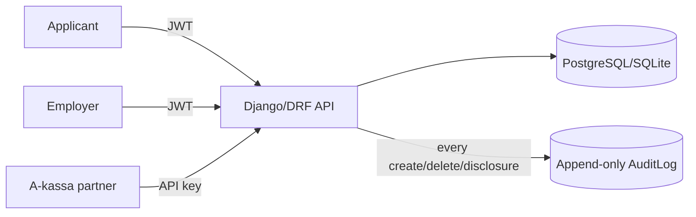

# af-jobbansokan-api


A Django REST API for **verifiable job application events**. Job seekers
register their applications, employers manage postings and review applicants —
and authorized unemployment benefit funds (A-kassa) can retrieve reliable,
audit-logged evidence of job seeking activity.

## Table of contents

- [Background](#background)
- [Features](#features)
- [Architecture](#architecture)
- [API overview](#api-overview)
- [Getting started](#getting-started)
- [Partner integration](#partner-integration)
- [Testing and linting](#testing-and-linting)
- [Project structure](#project-structure)
- [Security and privacy](#security-and-privacy)
- [Roadmap](#roadmap)
- [Documentation](#documentation)

## Background

Unemployment benefit funds in Sweden (A-kassa) largely rely on
self-attestation to verify that members are actively seeking work. Manual
verification is costly and enables fraud. This project explores a
verifiable, auditable and privacy-preserving alternative: job application
events are registered once, become immutable, and can be disclosed to
authorized parties — with every disclosure logged.

## Features

### For applicants

- JWT authentication (registration + login via dj-rest-auth)
- Register job application events — **immutable once created** (no editing,
  ever; deletion is allowed but audit logged)
- One application per posting; `applied_at` cannot be in the future
- List own events with date range and status filters

### For employers

- Organizations with role-based employer profiles (admin/member)
- Job postings: public read, write restricted to employer admins,
  always scoped to the admin's own organization
- Applications overview for the employer's own organization —
  every view is audit logged as a disclosure

### For A-kassa partners

- API key authentication (keys stored as SHA-256 hashes, issued once)
- Retrieve application events per person and time period
- Least-privilege responses: no applicant identifiers, no status
- Every call audit logged with partner, person, period and record count

### Platform

- Append-only audit log — read-only even for superusers
- OpenAPI 3 schema with Swagger UI
- Paginated list endpoints (20 per page)
- Modern admin UI ([django-unfold](https://unfoldadmin.com/))

## Architecture



| Layer | Technology |
| --- | --- |
| API | Django 5.2 + Django REST Framework 3.16 |
| Auth (users) | dj-rest-auth + allauth + SimpleJWT (15 min access, 7 d refresh, rotation + blacklist) |
| Auth (partners) | Custom API key authentication (SHA-256 hashed keys) |
| Database | SQLite (dev default) / PostgreSQL 16 (docker compose) |
| API docs | drf-spectacular (OpenAPI 3 + Swagger UI) |
| Quality | pytest, ruff, black — enforced in GitHub Actions CI |

## API overview

Base path: `/api/v1/` — full interactive docs at `/api/docs/`.

| Endpoint | Method | Who | Notes |
| --- | --- | --- | --- |
| `/health/` | GET | public | Health check (no `/api/v1` prefix) |
| `/dj-rest-auth/registration/` | POST | public | Create account, returns JWT |
| `/dj-rest-auth/login/` | POST | public | Returns access + refresh token |
| `/api/v1/me/` | GET | authenticated | Current user info |
| `/api/v1/applications/` | GET, POST | applicant | Own events; filter `?from=&to=&status=` |
| `/api/v1/applications/{id}/` | GET, DELETE | applicant | **No PUT/PATCH — events are immutable (405)** |
| `/api/v1/postings/` | GET | public | Paginated list |
| `/api/v1/postings/` | POST, PUT, PATCH, DELETE | employer admin | Scoped to own organization |
| `/api/v1/employer/applications/` | GET | employer | Own organization only; disclosure audit logged |
| `/api/v1/partner/application-events/` | GET | partner (API key) | `?person=<user id>&from=&to=`; disclosure audit logged |

## Getting started

Requirements: Python 3.13+ (3.14 works), git.

```bash
git clone https://github.com/OscarBackman92/af-jobbansokan-api.git
cd af-jobbansokan-api

python -m venv .venv
.venv/Scripts/activate          # Windows  (source .venv/bin/activate on Unix)
pip install -r requirements.txt

cp .env.example .env            # set DJANGO_DEBUG=1 for local development

python backend/manage.py migrate
python backend/manage.py createsuperuser
python backend/manage.py runserver
```

Then open:

- Swagger UI: <http://127.0.0.1:8000/api/docs/>
- Admin: <http://127.0.0.1:8000/admin/>
- Health check: <http://127.0.0.1:8000/health/>

### Using PostgreSQL instead of SQLite

```bash
docker compose -f infra/docker-compose.yml up -d
```

Then set the `DB_*` variables in `.env` (the compose file maps Postgres to
host port **5433**) and run `migrate` again.

### A quick end-to-end tour

```bash
# 1. Register an applicant (returns JWT immediately)
curl -X POST http://127.0.0.1:8000/dj-rest-auth/registration/ \
  -H "Content-Type: application/json" \
  -d '{"username": "anna", "password1": "Testpass123!", "password2": "Testpass123!"}'

# 2. Register an application event (posting created via admin or employer API)
curl -X POST http://127.0.0.1:8000/api/v1/applications/ \
  -H "Authorization: Bearer <access token>" -H "Content-Type: application/json" \
  -d '{"posting": 1, "applied_at": "2026-06-09"}'

# 3. List own events for a period
curl "http://127.0.0.1:8000/api/v1/applications/?from=2026-06-01&to=2026-06-30" \
  -H "Authorization: Bearer <access token>"
```

Employer accounts are provisioned via the admin (create an `Organization`
and an `EmployerProfile` linking a user to it).

## Partner integration

Partners (A-kassa systems) are issued an API key via a management command —
the key is shown **once** and only its SHA-256 hash is stored:

```bash
python backend/manage.py create_partner "A-kassan X"
# Partner 'A-kassan X' created.
# API key (shown only once): <key>
```

```bash
curl "http://127.0.0.1:8000/api/v1/partner/application-events/?person=2&from=2026-05-01&to=2026-06-30" \
  -H "Authorization: Api-Key <key>"
```

```json
[
  {
    "id": 1,
    "applied_at": "2026-06-09",
    "posting_title": "Backend Developer",
    "company_name": "Acme AB",
    "created_at": "2026-06-09T21:08:04Z"
  }
]
```

The response is deliberately minimal (least privilege): no applicant
identifiers beyond the queried person, no application status. Every call
writes an `applications.disclosed_partner` audit entry. Partners can be
deactivated in the admin; keys cannot be read back or recreated.

## Testing and linting

```bash
pytest            # 29 tests
ruff check .
black --check .
```

CI (GitHub Actions) runs all three on every pull request against `main`.

The OpenAPI schema can be validated with:

```bash
python backend/manage.py spectacular --validate --fail-on-warn
```

## Project structure

```text
backend/
  config/              # Django settings, root URLconf, WSGI/ASGI
  core/                # The single domain app
    management/        #   create_partner command
    migrations/
    tests/             #   pytest suite (API, permissions, audit, admin)
    admin.py           #   Admin (read-only audit log, unfold theme)
    audit.py           #   log_event() helper
    models.py          #   JobApplication, JobPosting, Organization,
                       #   EmployerProfile, PartnerClient, AuditLog
    partner_auth.py    #   API key authentication + permission
    permissions.py     #   Employer role permissions
    serializers.py
    views.py
docs/                  # Vision, architecture, threat model, GDPR, API spec
infra/                 # docker-compose for local PostgreSQL
.github/               # CI workflow, issue/PR templates
```

## Security and privacy

- **Immutability** — application events cannot be modified after creation;
  the API simply has no update route
- **Append-only audit log** — creation, deletion and every disclosure
  (employer and partner) is recorded; entries are read-only even in the
  admin and survive account deletion (actor set to NULL, metadata holds
  ids/counts only — no PII)
- **Least privilege** — applicants see only their own data, employers only
  their organization's applications, partners only a minimal payload for
  the person and period they query
- **Key handling** — partner API keys are stored as SHA-256 hashes and
  shown exactly once at creation
- **JWT hygiene** — short-lived access tokens, refresh rotation with
  blacklist

See [docs/03-security-threat-model.md](docs/03-security-threat-model.md)
and [docs/06-gdpr-privacy.md](docs/06-gdpr-privacy.md) for the full picture.

## Roadmap

- [ ] CSV/XLSX export for applicants
- [ ] BankID/eID authentication
- [ ] OAuth2/mTLS for partner integration
- [ ] Rate limiting / throttling
- [ ] Production hardening (whitenoise static serving, security headers)
- [ ] Employer onboarding flow (today provisioned via admin)

## Documentation

| Document | Contents |
| --- | --- |
| [01-vision-scope.md](docs/01-vision-scope.md) | Problem, vision, MVP scope, roles |
| [02-architecture.md](docs/02-architecture.md) | Components and data flows |
| [03-security-threat-model.md](docs/03-security-threat-model.md) | Threat model |
| [04-data-model.md](docs/04-data-model.md) | Entities and PII classification |
| [05-api-spec.md](docs/05-api-spec.md) | Endpoint reference |
| [06-gdpr-privacy.md](docs/06-gdpr-privacy.md) | GDPR considerations |
| [07-devops-ci-cd.md](docs/07-devops-ci-cd.md) | CI/CD setup |
