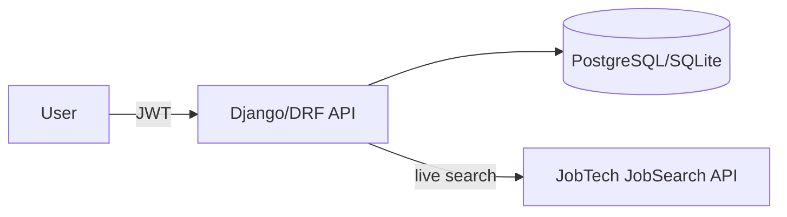

# Ansökt


**Koll på varje ansökan.** Job seekers build their own Excel sheets to
track applications — statuses, recruiter calls, interviews, next steps.
Ansökt is that sheet, done right: a kanban board over your applications,
a timeline per application, search over Platsbanken's job ads, and CSV
export because the data is yours.

> Pivoted 2026-06-12 from the earlier "verifiable job application events
> for A-kassa" concept — see [docs/10-pivot-ansokt.md](docs/10-pivot-ansokt.md)
> for the rationale and what changed.

## Features

- **The board** — drag-and-drop kanban over active applications:
  Sparad → Ansökt → Telefonintervju → Intervju → Skickad vidare →
  Erbjudande, with closed ones (Accepterat/Avslag/Inget svar/Återkallad)
  in an archive. Cards show a deadline badge as the last application day
  approaches
- **Follow-ups** — a section that surfaces rows whose next-step date has
  passed or whose deadline is within a week
- **Timeline per application** — notes, calls and interviews; status
  changes are logged automatically
- **Free-text rows** — track applications from anywhere (LinkedIn,
  e-mail, tips), not just imported ads
- **Job ad search** — searches all of Platsbanken **live** via
  Arbetsförmedlingen's open
  [JobTech JobSearch API](https://jobsearch.api.jobtechdev.se) (free, no
  API key), with filters for region, occupation field and remote; save
  an ad to the board with one click
- **CV** — upload a PDF/DOCX/TXT and it's parsed (in memory, never
  stored, using pypdf layout mode) into an always-visible, editable CV
  whose skills are matched against ad texts (boundary-aware, so "Go"
  doesn't match "Django")
- **Statistics** — applications per month and how many reached a
  call/interview or further
- **CSV export** (data portability)
- **Password reset by e-mail** and transparent JWT refresh, so a session
  never drops mid-task
- **E-mail based accounts** (registration + login via dj-rest-auth),
  with transparent JWT refresh so a session never drops mid-task;
  OpenAPI 3 schema with Swagger UI, modern admin
  ([django-unfold](https://unfoldadmin.com/))

## Architecture



| Layer | Technology |
| --- | --- |
| API | Django 5.2 + Django REST Framework 3.16 |
| Auth | dj-rest-auth + allauth (e-mail login) + SimpleJWT (15 min access, 7 d refresh, rotation + blacklist); SPA refreshes the access token on 401 |
| Database | SQLite (dev default) / PostgreSQL 16 (docker compose) |
| API docs | drf-spectacular (OpenAPI 3 + Swagger UI) |
| Frontend | React 19 + Vite (in `frontend/`) |
| Quality | pytest, ruff, black — enforced in GitHub Actions CI |

## API overview

Base path: `/api/v1/` — full interactive docs at `/api/docs/`.

| Endpoint | Method | Notes |
| --- | --- | --- |
| `/health/` | GET | Health check (no `/api/v1` prefix) |
| `/dj-rest-auth/registration/` | POST | Create account by e-mail, returns JWT |
| `/dj-rest-auth/login/` | POST | Log in by e-mail; returns access + refresh token |
| `/dj-rest-auth/token/refresh/` | POST | Exchange the refresh token for a new access (+ rotated refresh) token |
| `/api/v1/me/` | GET, PATCH, DELETE | Own profile; DELETE = GDPR erasure |
| `/api/v1/me/resume/` | GET, PUT, DELETE | Structured CV |
| `/api/v1/me/resume/parse/` | POST | Parse uploaded CV to a draft — file never stored |
| `/api/v1/applications/` | GET, POST | Tracker rows; `?status=&search=&from=&to=` |
| `/api/v1/applications/{id}/` | GET, PATCH, DELETE | Edit status, deadline, notes, contacts — fully mutable |
| `/api/v1/applications/{id}/events/` | POST | Append a timeline event |
| `/api/v1/applications/stats/` | GET | Counts per status |
| `/api/v1/applications/export/` | GET | CSV download (filters apply) |
| `/api/v1/jobs/` | GET | **Live Platsbanken search**; `?q=&region=&field=&remote=&offset=&limit=`; CV match per hit |
| `/api/v1/jobs/filters/` | GET | Region + occupation-field options for the search dropdowns |
| `/api/v1/postings/` | GET | Legacy DB-backed ads (optional `import_postings`); `?search=&location=&page_size=` |

## Getting started

Requirements: Python 3.13+ (3.14 works), git.

```bash
git clone https://github.com/OscarBackman92/af-jobbansokan-api.git
cd af-jobbansokan-api

python -m venv .venv
.venv/Scripts/activate          # Windows  (source .venv/bin/activate on Unix)
pip install -r requirements.txt

cp .env.example .env            # set DJANGO_DEBUG=1 for local development

python backend/manage.py migrate
python backend/manage.py createsuperuser
python backend/manage.py runserver
```

The **Annonser** tab searches Platsbanken live — no import needed. The
`import_postings` command remains only to seed the legacy DB-backed
`/api/v1/postings/` endpoint, and is optional:

```bash
python backend/manage.py import_postings --query "python" --limit 50
```

Then open:

- Swagger UI: <http://127.0.0.1:8000/api/docs/>
- Admin: <http://127.0.0.1:8000/admin/>
- Health check: <http://127.0.0.1:8000/health/>

### Frontend

The React/Vite app lives in `frontend/`: login/registration, the board,
ad search and profile/CV.

```bash
cd frontend
npm install
npm run dev          # http://localhost:5173 — Django must run on :8000
```

API calls are proxied by the Vite dev server, so no CORS configuration
is needed.

### Using PostgreSQL instead of SQLite

```bash
docker compose -f infra/docker-compose.yml up -d
```

Then set the `DB_*` variables in `.env` (the compose file maps Postgres to
host port **5433**) and run `migrate` again.

### A quick end-to-end tour

```bash
# 1. Register by e-mail (returns access + refresh JWT immediately)
curl -X POST http://127.0.0.1:8000/dj-rest-auth/registration/ \
  -H "Content-Type: application/json" \
  -d '{"email": "anna@example.com", "password1": "Testpass123!", "password2": "Testpass123!"}'

# 2. Add a free-text tracker row with a deadline
curl -X POST http://127.0.0.1:8000/api/v1/applications/ \
  -H "Authorization: Bearer <access token>" -H "Content-Type: application/json" \
  -d '{"company": "Acme AB", "title": "Backendutvecklare", "applied_at": "2026-06-09", "deadline": "2026-06-30"}'

# 3. Move it forward (auto-logs a timeline event)
curl -X PATCH http://127.0.0.1:8000/api/v1/applications/1/ \
  -H "Authorization: Bearer <access token>" -H "Content-Type: application/json" \
  -d '{"status": "screening"}'

# 4. See where you stand
curl http://127.0.0.1:8000/api/v1/applications/stats/ \
  -H "Authorization: Bearer <access token>"

# 5. When the access token expires, mint a new one with the refresh token
curl -X POST http://127.0.0.1:8000/dj-rest-auth/token/refresh/ \
  -H "Content-Type: application/json" \
  -d '{"refresh": "<refresh token>"}'
```

## Deployment

The repo is deploy-ready for [Render](https://render.com) (or any Docker
host):

- **One service serves everything**: the `Dockerfile` builds the frontend
  (Node stage), collects static files, and gunicorn + WhiteNoise serve
  the SPA at `/`, hashed assets, the API and the admin
- **`render.yaml` blueprint**: web service + managed Postgres; secrets
  are generated, `DATABASE_URL` is wired from the database
- **Production hardening** activates when `DJANGO_DEBUG=0`: HSTS,
  SSL redirect (behind proxy header), secure cookies, manifest static
  storage, referrer policy
- **Env-driven bootstrap on boot** (free tier has no shell): creates the
  superuser (`DJANGO_SUPERUSER_USERNAME`/`_PASSWORD`) and imports
  postings (`BOOTSTRAP_IMPORT_QUERY`, 50 ads) — idempotent and optional
- CI runs the backend tests against **Postgres 16** (same engine as
  production) plus the frontend build

Quick start: push to GitHub → render.com → **New → Blueprint** → select
the repo → **Apply**. Prefer to host the frontend on Vercel's CDN with
preview deploys? See [docs/11-deploy-vercel.md](docs/11-deploy-vercel.md)
for the split (frontend on Vercel, backend on Render).

### E-mail & password reset

Password reset sends an e-mail with a link back to the app. **In
development** no configuration is needed — Django's console backend
prints the e-mail (including the reset link) to the server log. **In
production the reset e-mail is only actually sent when SMTP is
configured**; without `EMAIL_HOST` set, reset silently no-ops from the
user's point of view.

Set these env vars in production (any SMTP provider — Brevo, Resend,
Postmark, …; the free tiers are enough):

| Variable | Purpose |
| --- | --- |
| `EMAIL_HOST` | SMTP host — **its presence switches on real e-mail** |
| `EMAIL_PORT` | SMTP port (default `587`) |
| `EMAIL_HOST_USER` | SMTP username |
| `EMAIL_HOST_PASSWORD` | SMTP password / API key |
| `EMAIL_USE_TLS` | `1` (default) or `0` |
| `DEFAULT_FROM_EMAIL` | From address, e.g. `Ansökt <no-reply@dindomän.se>` |
| `FRONTEND_URL` | Base URL the reset link points at (e.g. `https://ansokt.onrender.com`). Defaults to the request origin, which is correct for the single-service Render deploy; set it explicitly when the frontend is hosted separately (e.g. Vercel). |

The `render.yaml` blueprint lists these with `sync: false`, so Render
prompts for the values at deploy time instead of baking them in.

## Testing and linting

```bash
pytest            # backend test suite
ruff check .
black --check .
```

CI (GitHub Actions) runs all three on every pull request against `main`.

The OpenAPI schema can be validated with:

```bash
python backend/manage.py spectacular --validate --fail-on-warn
```

## Project structure

```text
backend/
  config/              # Django settings, root URLconf, WSGI/ASGI
  core/                # The single domain app
    management/        #   import_postings + bootstrap commands
    migrations/
    tests/             #   pytest suite (applications, auth, jobs, resume, ...)
    models.py          #   JobApplication, ApplicationEvent, JobPosting, Resume
    jobtech.py         #   live Platsbanken search + region/field taxonomy
    matching.py        #   boundary-aware CV skill matching
    resume.py          #   CV extraction (pypdf layout mode) + parsing
    serializers.py     #   incl. Email register + password-reset serializers
    views.py
frontend/
  src/
    api.js             #   fetch wrapper with refresh-on-401
    auth.js            #   token storage + JWT refresh
    statuses.js        #   status pipeline shared with the backend
    components/        #   AuthHero, BoardPanel, ApplicationModal,
                       #   PostingsPanel, ProfilePanel, ResetPassword
  vercel.json          #   optional: proxy /api to the backend on Vercel
docs/                  # Vision, architecture, GDPR, pivot, deploy guides
infra/                 # docker-compose for local PostgreSQL
.github/               # CI workflow, issue/PR templates
```

## Privacy

- Users see only their own data; deletion of the account cascades to
  everything it owns (GDPR right to erasure)
- CSV export doubles as data portability
- Uploaded CV files are parsed in memory and never stored
- Notes may contain third-party contact details (recruiters) — covered
  in the privacy policy, removed with the account
- No analytics, no third-party cookies; the JWT (access + refresh) lives
  in localStorage

See [docs/06-gdpr-privacy.md](docs/06-gdpr-privacy.md) and
[docs/10-pivot-ansokt.md](docs/10-pivot-ansokt.md).

## Roadmap

- [x] Live JobTech search with region/occupation/remote filters
- [x] Password reset by e-mail (SMTP via env in production)
- [ ] Reminders for `next_action_at` (e-mail or notification)
- [ ] XLSX export alongside CSV
- [ ] JobStream API for continuous ad updates
- [ ] Privacy policy page before public launch
- [ ] EU hosting region (Render Frankfurt)

## Documentation

| Document | Contents |
| --- | --- |
| [10-pivot-ansokt.md](docs/10-pivot-ansokt.md) | **The pivot: rationale, product, legal, what changed** |
| [11-deploy-vercel.md](docs/11-deploy-vercel.md) | Deploy guide: frontend on Vercel, backend on Render |
| [08-identity-bankid.md](docs/08-identity-bankid.md) | Archived note: identity verification is out of scope |
| [01-vision-scope.md](docs/01-vision-scope.md) | Original vision (pre-pivot) |
| [02-architecture.md](docs/02-architecture.md) | Components and data flows |
| [04-data-model.md](docs/04-data-model.md) | Entities and PII classification (pre-pivot) |
| [06-gdpr-privacy.md](docs/06-gdpr-privacy.md) | GDPR considerations |
| [07-devops-ci-cd.md](docs/07-devops-ci-cd.md) | CI/CD setup |
