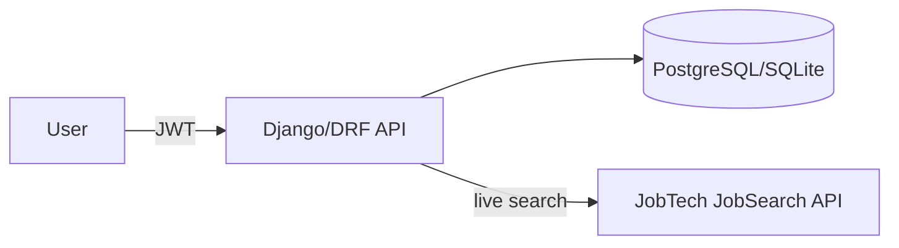

# Jobbdjungeln


**Koll på hela ditt jobbsök.** Job seekers build their own Excel sheets to
track applications — statuses, recruiter calls, interviews, next steps.
Jobbdjungeln (formerly "Ansökt") is that sheet, done right: a kanban board
over your applications, a timeline per application, search over
Platsbanken's job ads, monthly AF-style reporting, and CSV export because
the data is yours.

> Production: [jobbdjungeln.obackman.se](https://jobbdjungeln.obackman.se)
> (Render Frankfurt, custom domain). The SPA lives at `/app/`. The Render
> web service is still named `jobbjungeln`; cron jobs keep the `ansokt-*`
> names from the original deploy. Legacy `jobbjungeln.onrender.com` is
> rewritten to the canonical origin for e-mail links.

> Pivoted 2026-06-12 from the earlier "verifiable job application events
> for A-kassa" concept — see [docs/10-pivot-ansokt.md](docs/10-pivot-ansokt.md)
> for the rationale and what changed.

## Features

- **Översikt** — läsvy med KPI:er, nästa steg, tratt, utfall och takt;
  länkar vidare till sparade jobb och ansökningar med förvalda filter
- **Sparade jobb** — enbart status Sparad (wishlist), grupperade efter
  "sök senast" (bråttom / den här månaden / utan sista dag / lagt på is /
  utgångna). Ansök ↗ → bekräfta "Ja, sökt idag" är vägen till Ansökningar
- **Ansökningar** — enbart sökta rader (allt utom wishlist), grupperade
  efter väntetid och dialog: Väntar för länge → Nyligen sökta → I dialog →
  Erbjudande → Avslutade. Statusbyte loggas automatiskt i tidslinjen
- **Rapportera** — månadsvis AF-aktivitetsrapport (sökta jobb,
  sidoaktiviteter, exkludera rader, CSV). Personligt hjälpmedel, ingen
  myndighetskoppling
- **Timeline per application** — notes, calls and interviews; status
  changes are logged automatically
- **Free-text rows** — track applications from anywhere (LinkedIn,
  e-mail, tips), not just imported ads
- **Job ad search** — searches all of Platsbanken **live** via
  Arbetsförmedlingen's open
  [JobTech JobSearch API](https://jobsearch.api.jobtechdev.se) (free, no
  API key), with filters for region, occupation field and remote; save
  an ad with one click
- **CV** — upload a PDF/DOCX/TXT and it's parsed (in memory, never
  stored, using pypdf layout mode) into an always-visible, editable CV
  whose skills are matched against ad texts (boundary-aware, so "Go"
  doesn't match "Django")
- **Statistics** — applications per month and how many reached a
  call/interview or further (on Översikt)
- **CSV export** (data portability) and **ICS** for follow-ups / deadlines
- **Password reset by e-mail** and transparent JWT refresh, so a session
  never drops mid-task
- **E-mail based accounts** (registration + login via dj-rest-auth);
  no JWT until the address is verified. OpenAPI 3 schema with Swagger UI
  (debug or staff in production), modern admin
  ([django-unfold](https://unfoldadmin.com/))

## Architecture


```mermaid
flowchart LR
    U[User] -- JWT --> API[Django/DRF API]
    API --> DB[(PostgreSQL/SQLite)]
    API -- live search --> JT[JobTech JobSearch API]
```

| Layer | Technology |
| --- | --- |
| API | Django 5.2 + Django REST Framework 3.16 |
| Auth | dj-rest-auth + allauth (e-mail login) + SimpleJWT (15 min access, 7 d refresh, rotation + blacklist); SPA refreshes the access token on 401 |
| Database | SQLite (local debug without `DB_*`) / PostgreSQL via `DB_*` or `DATABASE_URL` (prod, required when `DJANGO_DEBUG=0`) |
| API docs | drf-spectacular (OpenAPI 3 + Swagger UI), version 0.2.0 |
| Frontend | React 19 + Vite 7 (in `frontend/`, base `/app/`) |
| Quality | pytest (cov ≥70 %), ruff, black, ESLint, Vitest, Playwright — GitHub Actions CI |

## API overview

Domain API: `/api/v1/`. Interactive docs at `/api/docs/` (open in local
debug; staff-only in production). Full list:
[docs/05-api-spec.md](docs/05-api-spec.md).

| Endpoint | Method | Notes |
| --- | --- | --- |
| `/health/` | GET | Health check (no `/api/v1` prefix) |
| `/dj-rest-auth/registration/` | POST | Create account by e-mail; sends verification mail (no JWT until verified) |
| `/dj-rest-auth/login/` | POST | Log in by e-mail; returns access + refresh token |
| `/dj-rest-auth/token/refresh/` | POST | Exchange the refresh token for a new access (+ rotated refresh) token |
| `/dj-rest-auth/google/` | POST | Google login (optional; button hidden when `GOOGLE_CLIENT_ID` unset) |
| `/api/v1/me/` | GET, PATCH, DELETE | Own profile; DELETE = GDPR erasure |
| `/api/v1/me/resume/` | GET, PUT, PATCH, DELETE | Structured CV |
| `/api/v1/me/resume/parse/` | POST | Parse uploaded CV to a draft — file never stored |
| `/api/v1/dashboard/` | GET | Översikt KPIs, funnel, next actions, monthly, pace |
| `/api/v1/insights/skills/` | GET | Aggregated skill hits/gaps from match snapshots |
| `/api/v1/applications/` | GET, POST | Tracker rows; `?status=&search=&from=&to=&archived=1&page_size=` (list omits `events`; archived hidden by default) |
| `/api/v1/applications/{id}/` | GET, PATCH, DELETE | Edit status, apply_by, intent, notes, contacts — fully mutable; includes `events` |
| `/api/v1/applications/{id}/events/` | POST | Append a timeline event |
| `/api/v1/applications/tracked-urls/` | GET | All ad URLs including archived (duplicate protection) |
| `/api/v1/applications/saved-summary/` | GET | Lane counts for Sparade jobb |
| `/api/v1/applications/bulk/` | POST | Bulk mark_applied / archive / pause / activate / set_apply_by |
| `/api/v1/applications/similar/` | GET | Notice-only duplicates (`company`, `title`, `source_job_id`) |
| `/api/v1/applications/export/` | GET | CSV download (filters apply; includes intent + apply_by) |
| `/api/v1/jobs/` | GET | **Live Platsbanken search**; `?q=&region=&field=&remote=&offset=&limit=`; CV match per hit; identical searches cached 3 min |
| `/api/v1/jobs/filters/` | GET | Region + occupation-field options for the search dropdowns |
| `/api/v1/jobs/occupations/` | GET | Occupation-name autocomplete (`?q=`) |
| `/api/v1/jobs/{job_id}/` | GET | One Platsbanken ad by JobTech id |
| `/api/v1/me/saved-searches/` | GET, POST | Saved Platsbanken search presets |
| `/api/v1/periods/` | GET | AF report months |
| `/api/v1/periods/{YYYY-MM}/` | GET | Month detail; `submit/`, `reopen/`, `export/`, `exclude/` as subpaths |
| `/api/v1/activities/` | GET, POST | Side activities for the AF report |

## Getting started

Requirements: Python 3.13+ (3.14 works), git, Node 22 for the frontend.

```bash
git clone https://github.com/OscarBackman92/af-jobbansokan-api.git
cd af-jobbansokan-api

python -m venv .venv
.venv/Scripts/activate          # Windows  (source .venv/bin/activate on Unix)
pip install -r requirements.txt

cp .env.example .env            # DJANGO_DEBUG=1
# SQLite (simplest): comment out the DB_* block in .env
# Docker Postgres: keep DB_* (host port 5433) and start compose first:
#   docker compose -f infra/docker-compose.yml up -d

python backend/manage.py migrate
python backend/manage.py createsuperuser
python backend/manage.py runserver
```

The **Annonser** tab searches Platsbanken live via `/api/v1/jobs/` — no
import or local ad database is required.

Then open:

- Marketing landing: <http://127.0.0.1:8000/>
- Swagger UI: <http://127.0.0.1:8000/api/docs/>
- Admin: <http://127.0.0.1:8000/admin/>
- Health check: <http://127.0.0.1:8000/health/>

### Frontend

The React/Vite app lives in `frontend/` (dev URL
`http://localhost:5173/app/`): login/registration, Översikt, board,
Rapportera, ad search and profile/CV.

```bash
cd frontend
npm install
npm run dev          # http://localhost:5173/app/ — Django must run on :8000
```

API calls are proxied by the Vite dev server, so no CORS configuration
is needed.

### Using PostgreSQL instead of SQLite

```bash
docker compose -f infra/docker-compose.yml up -d
```

Then set the `DB_*` variables in `.env` (the compose file maps Postgres to
host port **5433**) and run `migrate` again.

### A quick end-to-end tour

Registration does not return JWT. In development the verification e-mail
is printed to the Django console (`EMAIL_BACKEND` console). Copy the
`verify_key` from the log, confirm, then log in.

```bash
# 1. Register by e-mail (201; verification mail, no tokens)
curl -X POST http://127.0.0.1:8000/dj-rest-auth/registration/ \
  -H "Content-Type: application/json" \
  -d '{"email": "anna@example.com", "password1": "Testpass123!", "password2": "Testpass123!"}'

# 2. Confirm the address (key from the console e-mail)
curl -X POST http://127.0.0.1:8000/dj-rest-auth/registration/verify-email/ \
  -H "Content-Type: application/json" \
  -d '{"key": "<verify key>"}'

# 3. Log in
curl -X POST http://127.0.0.1:8000/dj-rest-auth/login/ \
  -H "Content-Type: application/json" \
  -d '{"email": "anna@example.com", "password": "Testpass123!"}'

# 4. Add a free-text tracker row with a deadline
curl -X POST http://127.0.0.1:8000/api/v1/applications/ \
  -H "Authorization: Bearer <access token>" -H "Content-Type: application/json" \
  -d '{"company": "Acme AB", "title": "Backendutvecklare", "applied_at": "2026-06-09", "deadline": "2026-06-30"}'

# 5. Move it forward (auto-logs a timeline event)
curl -X PATCH http://127.0.0.1:8000/api/v1/applications/1/ \
  -H "Authorization: Bearer <access token>" -H "Content-Type: application/json" \
  -d '{"status": "screening"}'

# 6. When the access token expires, mint a new one with the refresh token
curl -X POST http://127.0.0.1:8000/dj-rest-auth/token/refresh/ \
  -H "Content-Type: application/json" \
  -d '{"refresh": "<refresh token>"}'
```

## Deployment

The repo is deploy-ready for [Render](https://render.com) (or any Docker
host):

- **One service serves everything**: the `Dockerfile` builds the frontend
  (Node stage), collects static files, and gunicorn + WhiteNoise serve
  marketing pages at `/`, the SPA at `/app/`, hashed assets, the API and
  the admin
- **`render.yaml` blueprint**: web service + cron jobs on Render; **Supabase**
  Postgres in production (`DATABASE_URL` set manually in Render dashboard)
- **Production hardening** activates when `DJANGO_DEBUG=0`: HSTS,
  SSL redirect (behind proxy header), secure cookies, manifest static
  storage, referrer policy
- **Env-driven bootstrap on boot** (no shell required): creates the
  superuser (`DJANGO_SUPERUSER_USERNAME`/`_PASSWORD`) and syncs the
  public site domain from `FRONTEND_URL` — idempotent
- CI runs the backend tests against **Postgres 16** (same engine as
  production) plus the frontend build, typecheck and Playwright e2e

Quick start: push to GitHub → render.com → **New → Blueprint** → select
the repo → **Apply**. Prefer to host the frontend on Vercel's CDN with
preview deploys? See [docs/11-deploy-vercel.md](docs/11-deploy-vercel.md)
for the split (frontend on Vercel, backend on Render).

### E-mail & password reset

Password reset sends an e-mail with a link back to `/app/`. **In
development** no configuration is needed — Django's console backend
prints the e-mail (including the reset link) to the server log.

**In production on Render**, set `BREVO_API_KEY` (HTTP API — SMTP ports
are often blocked). Classic SMTP (`EMAIL_HOST`) is a fallback on other
hosts. Without either, reset and verification silently no-op from the
user's point of view.

| Variable | Purpose |
| --- | --- |
| `BREVO_API_KEY` | Production e-mail on Render (switches on Anymail/Brevo) |
| `EMAIL_HOST` | SMTP host — fallback when Brevo is unset |
| `EMAIL_PORT` | SMTP port (default `587`) |
| `EMAIL_HOST_USER` | SMTP username |
| `EMAIL_HOST_PASSWORD` | SMTP password / API key |
| `EMAIL_USE_TLS` | `1` (default) or `0` |
| `DEFAULT_FROM_EMAIL` | From address, e.g. `Jobbdjungeln <no-reply@dindomän.se>` |
| `FRONTEND_URL` | Public origin for e-mail links (canonical: `https://jobbdjungeln.obackman.se`). Defaults to the request origin locally. Set explicitly when the frontend is hosted separately (e.g. Vercel). |
| `GOOGLE_CLIENT_ID` / `GOOGLE_CLIENT_SECRET` | Optional. Enables "Fortsätt med Google": create an OAuth client in Google Cloud Console with the site URL (trailing slash) as authorized redirect URI. The login button is hidden while unset. |
| `CONTACT_EMAIL` | Public contact for privacy questions and vulnerability reports. Shown in the in-app privacy policy and served at `/.well-known/security.txt` (404 while unset). |

The `render.yaml` blueprint lists these with `sync: false`, so Render
prompts for the values at deploy time instead of baking them in.

## Testing and linting

```bash
pytest            # backend test suite
ruff check .
black --check .

cd frontend
npm test          # Vitest unit tests
npm run lint      # ESLint
npm run typecheck
npm run test:e2e  # Playwright smoke tests (starts backend + frontend itself)
```

The E2E suite boots its own stack: a throwaway Django backend (fresh
SQLite, mail written to files), a mocked JobTech server and the Vite dev
server — no manual setup, but run `npx playwright install chromium` once.

CI (GitHub Actions) runs everything on every pull request against `main`
and on every push to `main`.

The OpenAPI schema can be validated with:

```bash
python backend/manage.py spectacular --validate --fail-on-warn
```

## Project structure

```text
backend/
  config/              # Django settings, root URLconf, WSGI/ASGI
  core/                # The single domain app
    management/        #   bootstrap, reminders, prune, weekly summary, …
    migrations/
    tests/             #   pytest suite
    models.py          #   JobApplication, ApplicationEvent, Resume,
                       #   SavedJobSearch, OperatorProfile, ReportPeriod,
                       #   Activity, JobPosting (legacy)
    jobtech.py         #   live Platsbanken search + region/field taxonomy
    matching.py        #   boundary-aware CV skill matching
    periods.py         #   AF report month packing
    resume.py          #   CV extraction (pypdf layout mode) + parsing
    serializers.py     #   incl. Email register + password-reset serializers
    views.py / period_views.py
  templates/           #   marketing pages + account e-mails
frontend/
  src/
    api.ts             #   fetch wrapper with refresh-on-401
    auth.ts            #   token storage + JWT refresh
    statuses.ts        #   status pipeline shared with the backend
    components/        #   AuthHero, DashboardPanel, SavedPanel,
                       #   AppliedPanel, ReportPanel, ApplicationModal,
                       #   PostingsPanel, ProfilePanel, ResetPassword
                       #   board/ MetricTile, ApplicationRow, …
  vercel.json          #   optional: proxy /api to the backend on Vercel
docs/                  # Vision, architecture, API, GDPR, pivot, deploy
infra/                 # docker-compose for local PostgreSQL
.github/               # CI workflow, Dependabot, issue/PR templates
```

## Privacy

- Users see only their own data; deletion of the account cascades to
  everything it owns (GDPR right to erasure)
- CSV export doubles as data portability (applications and monthly reports)
- Uploaded CV files are parsed in memory and never stored
- Notes may contain third-party contact details (recruiters) — covered
  in the privacy policy, removed with the account
- No analytics, no third-party cookies; the JWT (access + refresh) lives
  in localStorage
- Retention: accounts inactive for 24 months are deleted by the daily
  cron (`prune_inactive_accounts`) after a 30-day warning e-mail;
  logging in resets the clock
- Monday weekly summary e-mail with pipeline overview and new hits from
  saved Platsbanken searches (`send_weekly_summary`)
- Password change/reset revokes all outstanding refresh tokens
- Vulnerability reports: `/.well-known/security.txt` (served when
  `CONTACT_EMAIL` is set)

See [docs/06-gdpr-privacy.md](docs/06-gdpr-privacy.md),
[docs/16-incidentrutin.md](docs/16-incidentrutin.md) (incident response)
and [docs/17-registerforteckning.md](docs/17-registerforteckning.md)
(records of processing).

## Roadmap

The product is feature-complete for personal use and live at
<https://jobbdjungeln.obackman.se>. The current focus is
[docs/15-vag-till-fardig-webapp.md](docs/15-vag-till-fardig-webapp.md)
and [docs/13-lanseringsplan.md](docs/13-lanseringsplan.md): e-mail
deliverability, uptime monitoring, then mobile stores when the web app is
stable. Google login is prepared in code but not enabled in production
(September 2026).

- [x] Live JobTech search with region/occupation/remote filters
- [x] Password reset by e-mail (Brevo HTTP API in production)
- [x] Mandatory e-mail verification + operator IDs
- [x] Reminders for `next_action_at` (daily cron e-mail)
- [x] Saved JobTech searches
- [x] Duplicate detection for tracked ads
- [x] Privacy policy page (`/integritet/`)
- [x] Calendar export (ICS) for follow-ups and deadlines
- [x] Playwright E2E smoke tests in CI
- [x] Google login (code ready — needs OAuth client + env vars)
- [x] EU hosting: Render Frankfurt + Supabase Postgres (EU)
- [x] Custom domain (`jobbdjungeln.obackman.se`)
- [ ] Uptime check and verified e-mail sender domain
- [x] Weekly summary e-mail (applications, follow-ups, saved-search digest)
- [x] AF-style monthly reporting (Rapportera)
- [ ] XLSX export alongside CSV
- [ ] JobStream API for continuous ad updates

## Documentation

| Document | Contents |
| --- | --- |
| [01-vision-scope.md](docs/01-vision-scope.md) | Current vision and scope |
| [02-architecture.md](docs/02-architecture.md) | Components and data flows |
| [03-security-threat-model.md](docs/03-security-threat-model.md) | Threats and mitigations |
| [04-data-model.md](docs/04-data-model.md) | Entities and PII classification |
| [05-api-spec.md](docs/05-api-spec.md) | HTTP API |
| [06-gdpr-privacy.md](docs/06-gdpr-privacy.md) | GDPR considerations |
| [07-devops-ci-cd.md](docs/07-devops-ci-cd.md) | Local, CI, Render |
| [08-identity-bankid.md](docs/08-identity-bankid.md) | Archived: identity verification is out of scope |
| [09-master-plan.md](docs/09-master-plan.md) | Historical master plan |
| [10-pivot-ansokt.md](docs/10-pivot-ansokt.md) | **The pivot: rationale, product, legal** |
| [11-deploy-vercel.md](docs/11-deploy-vercel.md) | Optional: frontend on Vercel, backend on Render |
| [12-utvecklingsplan.md](docs/12-utvecklingsplan.md) | Earlier development plan (mostly done) |
| [13-lanseringsplan.md](docs/13-lanseringsplan.md) | Launch plan: hosting, go-public, remaining ops |
| [14-sakerhet-produktion.md](docs/14-sakerhet-produktion.md) | Production security checklist (Render, Sentry, Brevo) |
| [15-vag-till-fardig-webapp.md](docs/15-vag-till-fardig-webapp.md) | Master checklist: drift, kvalitet, retention, mobil (pausat) |
| [16-incidentrutin.md](docs/16-incidentrutin.md) | Incident response |
| [17-registerforteckning.md](docs/17-registerforteckning.md) | Records of processing |
| [18-manuell-test-och-cron.md](docs/18-manuell-test-och-cron.md) | Cron on Render + manual test checklist |
| [19-sakerhetsaudit-2026-07-10.md](docs/19-sakerhetsaudit-2026-07-10.md) | Security audit (July 2026) |

Copy-paste QA prompts (`docs/claude-*.md`, `docs/chatgpt-manuell-test-prompt.md`)
are operational checklists, not product spec. Dated test reports stay as
historical records.
