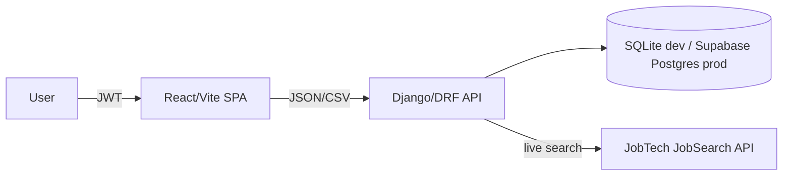

# Architecture

## Components

- **Frontend:** React 19 and Vite. It handles auth, board UI, Platsbanken
  search, profile/CV editing and password reset.
- **API:** Django 5.2, Django REST Framework and dj-rest-auth.
- **Auth:** Email login with JWT access and refresh tokens. The SPA refreshes an
  expired access token once before logging the user out.
- **Database:** SQLite for local development (`DJANGO_DEBUG=1` without
  `DATABASE_URL`). Production requires `DATABASE_URL` (Supabase Postgres EU).
- **Static files:** `collectstatic` runs at container start in Docker deploy.
- **External data:** JobTech JobSearch API for live Platsbanken results.
- **Static serving:** The Docker deploy builds the frontend and serves it with
  WhiteNoise from the Django service.

## Key Flows

1. User registers or logs in by email.
2. User creates manual application rows or saves live JobTech ads to the board.
3. Status changes append timeline events automatically.
4. User uploads a CV for in-memory parsing, reviews the draft and saves only
   structured fields.
5. Job searches can include explainable skill matches from the saved CV.
6. User exports CSV or deletes the account and all owned data.

## Operational Notes

- Keep the monolith while the product is small.
- Add background jobs only when reminders or digests are implemented.
- Add monitoring before public traffic.
