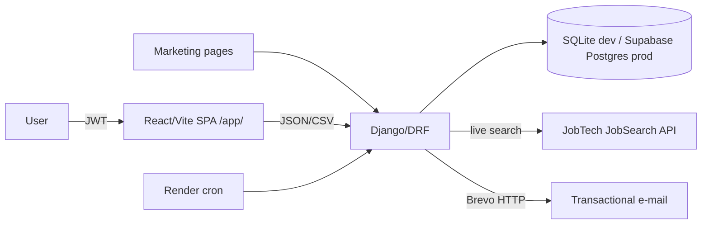

# Architecture

```mermaid
flowchart LR
    U[User] -- JWT --> SPA[React/Vite SPA /app/]
    M[Marketing pages] --> API[Django/DRF]
    SPA -- JSON/CSV --> API
    API --> DB[(SQLite dev / Supabase Postgres prod)]
    API -- live search --> JT[JobTech JobSearch API]
    Cron[Render cron] --> API
    API -- Brevo HTTP --> Mail[Transactional e-mail]
```

Canonical production origin: `https://jobbdjungeln.obackman.se`
(Render service name `jobbjungeln`, Frankfurt). The SPA is served at
`/app/`. Public marketing pages live at `/`, `/integritet/`, `/om/`,
`/faq/`.

## Components

- **Frontend:** React 19 and Vite (`frontend/`, base path `/app/`). Auth,
  Översikt, Sparade jobb, Ansökningar, Rapportera, Platsbanken search,
  profile/CV and password reset. Dev server proxies `/api`,
  `/dj-rest-auth`, `/health` and `/runtime-config.js` to Django on
  `:8000`.
- **API:** Django 5.2, Django REST Framework 3.16, dj-rest-auth,
  django-allauth, SimpleJWT. OpenAPI via drf-spectacular (`0.2.0`).
  Admin uses django-unfold.
- **Auth:** Email login with JWT (15 min access, 7 d refresh, rotation +
  blacklist). Registration does **not** issue JWT until the address is
  verified. The SPA retries once with the refresh token on 401. Tokens
  live in `localStorage` (not httpOnly cookies).
- **Database:** SQLite when `DJANGO_DEBUG=1` and no `DATABASE_URL` /
  `DB_*`. Local Postgres via `infra/docker-compose.yml` (host port
  **5433**). Production requires `DATABASE_URL` (Supabase Postgres EU)
  when `DJANGO_DEBUG=0`.
- **Static files:** Docker multi-stage build (Node 22 frontend, Python
  3.13 backend). `collectstatic` runs at container start. WhiteNoise
  serves hashed assets, marketing pages and the SPA.
- **External data:** JobTech JobSearch API for live Platsbanken results
  (no API key). Identical searches are cached 3 minutes. JobTech
  timeouts become a friendly 502.
- **Background jobs:** Render cron (not an in-process queue):
  `send_reminders` daily 06:00 UTC, `prune_inactive_accounts` daily
  06:15 UTC, `send_weekly_summary` Mondays 07:00 UTC. Cron service names
  still use the `ansokt-*` prefix.
- **E-mail:** Console backend in development. Production on Render uses
  Brevo's HTTP API (`BREVO_API_KEY`). SMTP (`EMAIL_HOST`) is a fallback
  on hosts that allow ports 587/465.
- **Observability:** Optional Sentry (backend DSN + frontend DSN via
  `/runtime-config.js`). `/health/` is public; `/api/docs/` requires
  debug or staff in production.

## Key Flows

1. User registers by email, verifies the address, then logs in (JWT).
2. User creates manual application rows or saves live JobTech ads.
   Wishlist rows live on Sparade jobb; everything else on Ansökningar.
3. Status changes append timeline events automatically. Derived `stage`
   / `outcome` stay in sync with `status`.
4. User uploads a CV for in-memory parsing, reviews the draft and saves
   only structured fields (including skill groups and job profiles).
5. Job searches can include explainable skill matches from the saved CV.
6. Rapportera packs a calendar month of sought jobs, reportable events
   and side activities for the user's AF activity report.
7. User exports CSV (or a period CSV), downloads ICS from the board, or
   deletes the account and all owned data.

## Operational Notes

- Keep the monolith while the product is small. One Docker service
  serves marketing, SPA, API and admin.
- Background work is Render cron today; add an in-process queue only if
  volume outgrows daily/weekly jobs.
- Production hardening (`DJANGO_DEBUG=0`): HSTS, SSL redirect behind
  the proxy, secure cookies, manifest static storage, CSP.
- Optional split: frontend on Vercel, API on Render — see
  [11-deploy-vercel.md](11-deploy-vercel.md).
